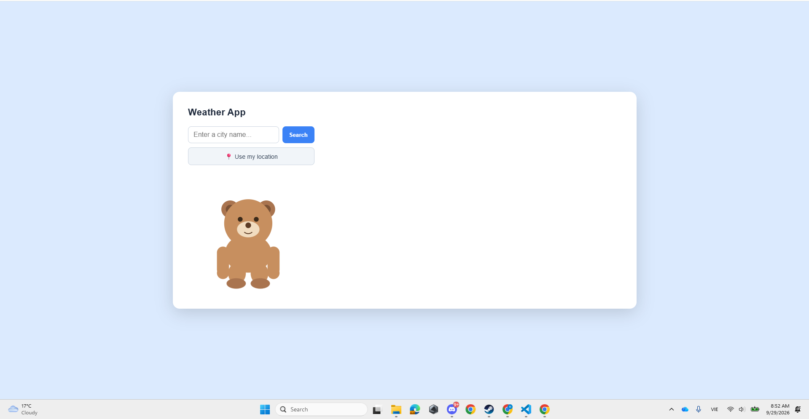
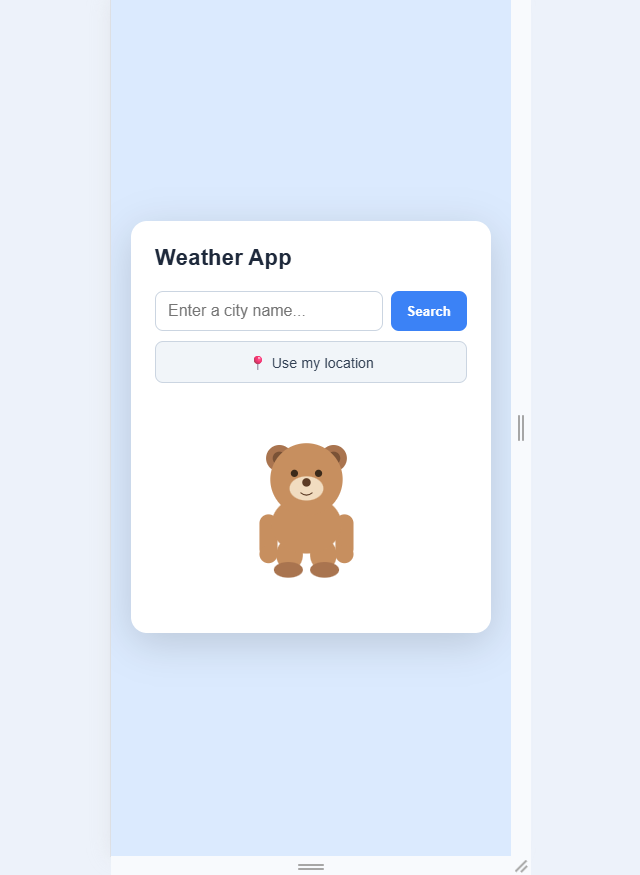

# Weather App

A responsive weather app that shows current conditions, an hourly outlook, and a 5-day forecast for any city — with a bear mascot that changes outfit based on the live weather and temperature. Built as Task 3 of the AVIP 2026 Web Development track by B.Y.T.E x Arithmatrix.

🔗 **Live demo:** [add your deployed link here]
📂 **Repo:** (https://github.com/HiepNgan/WD_2_WeatherApp_byte)

---

## 📸 Screenshots

| Desktop | Mobile |
|---|---|
|  |  |


---

## ✨ Features

- **Search by city name**, or **use current location** via the browser's Geolocation API
- **Current conditions** — temperature, "feels like", condition, humidity, weather icon
- **Invalid city handling** — clear error message instead of a silent failure or stale data
- **Local time clock** for the searched city, computed from the API's UTC offset and updated every second (not the visitor's own time zone)
- **Day/night detection** using the real sunrise/sunset times for that city — the background and a star field switch automatically
- **Animated weather background** — rain, snow, sun glow, drifting clouds, mist and lightning, built with plain CSS/SVG animations
- **Hourly outlook (next 24h)** — the free API only returns data every 3 hours, so the in-between hours are linearly interpolated and clearly labelled as estimated
- **5-day forecast**
- **Weather-reactive bear mascot** — outfit, accessories and small animated effects (raindrops, breath fog, sweat, butterflies, wind lines...) change based on the condition, temperature and wind speed together, e.g. a hot sunny day gives shorts + tank top + sweat + ice cream, while a storm sends the bear indoors
- **Subtle 3D tilt** on the card, following the cursor

---

## 🛠 Tech Stack

- HTML5 (semantic structure, meta tags for SEO)
- CSS3 (gradients, keyframe animations, `:has()` selector)
- Vanilla JavaScript — `fetch`, `async/await`, `Intersection`-free DOM updates, `Geolocation` API
- Inline SVG with SMIL animations (`<animate>`, `<animateTransform>`, `<animateMotion>`) for the bear mascot and its accessories
- **[OpenWeatherMap API](https://openweathermap.org/api)** — Current Weather Data endpoint + 5 Day / 3 Hour Forecast endpoint (free tier)

No build tools, no dependencies — open `index.html` directly in a browser (or use Live Server for the location feature, since some browsers restrict Geolocation on `file://`).

---

## 🚀 Running locally

```bash
git clone https://github.com/<HiepNgan>/WD_2_WeatherApp_byte.git
cd WD_2_WeatherApp_byte
```

1. Get a free API key at [openweathermap.org/api](https://openweathermap.org/api) (new keys can take up to an hour to activate)
2. Open `script.js` and paste your key into the first line:
```js
   const API_KEY = "YOUR_KEY_HERE";
```
3. Open `index.html` in your browser — or use the **Live Server** extension in VS Code

---

## 📁 Project structure